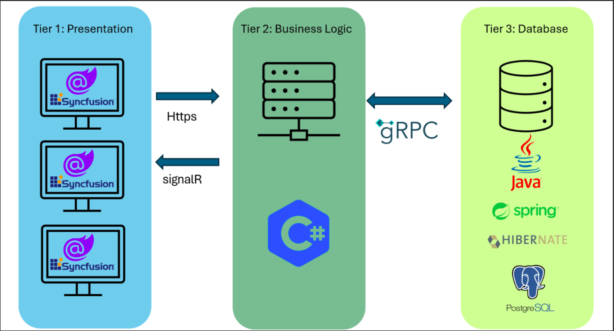
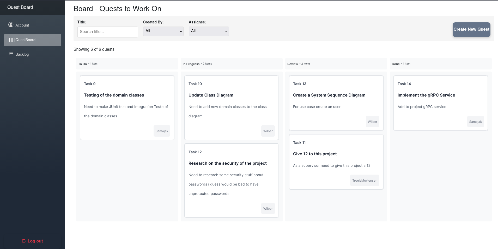
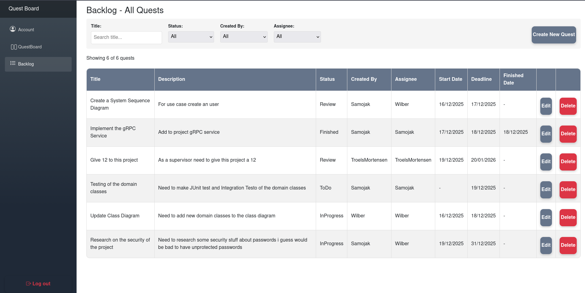

# QuestBoard

QuestBoard is a distributed Kanban-style task management system inspired by the concept of quests.  
It is implemented as a three-tier application with a strong focus on separation of concerns, scalability, and real-time collaboration.

The project was developed as part of a university semester project with emphasis on distributed systems, system architecture, and clean design.

## Overview

QuestBoard allows users to create, assign, and track quests across different states using a visual Kanban board.  
The system is split into three independent tiers that communicate using HTTP and gRPC.

## Architecture

QuestBoard follows a classic three-tier architecture.

- Presentation Tier  
  Blazor WebAssembly client responsible for user interaction and UI rendering

- Application Tier  
  ASP.NET Web API handling business logic, validation, and orchestration

- Data Tier  
  Java Spring Boot service responsible for persistence and database access

Communication flow:

Blazor Client -> HTTP -> ASP.NET Web API -> gRPC -> Java Service -> PostgreSQL

## Features

Visual task management using a Kanban board.

Backlog and quest management functionality.

Key features:
- Kanban board with quest status transitions
- Quest creation, assignment, and updates
- Real-time updates using SignalR
- gRPC communication between application and data tiers
- Clear separation of responsibilities across tiers
- Designed for extensibility and maintainability

## Tech Stack

Presentation Tier:
- Blazor WebAssembly
- Syncfusion Kanban components

Application Tier:
- ASP.NET Web API (.NET)
- SignalR
- gRPC client

Data Tier:
- Java Spring Boot
- Hibernate / JPA
- PostgreSQL
- gRPC server

Other:
- REST over HTTPS
- Protocol Buffers
- GitHub for version control

## Running the System

QuestBoard is a three-tier application. All tiers must be running.

First, ensure PostgreSQL is running and the database is available.

Start the data tier (Java, Spring Boot):

cd tier-3-data  
mvn spring-boot:run  

This starts the gRPC server and connects to PostgreSQL.

Start the application tier (ASP.NET Web API):

cd SEP3/Tier 2 Server C#/WebAPI/WebAPI  
dotnet run --launch-profile https  

This exposes REST endpoints for the client and communicates with the data tier via gRPC.

Start the presentation tier (Blazor client):

cd SEP3/Tier 1 Client/BlazorApp  
dotnet run --launch-profile https  

Open the application in the browser using the URL shown in the console.

Startup order: PostgreSQL, Java data tier, .NET application tier, Blazor client.
